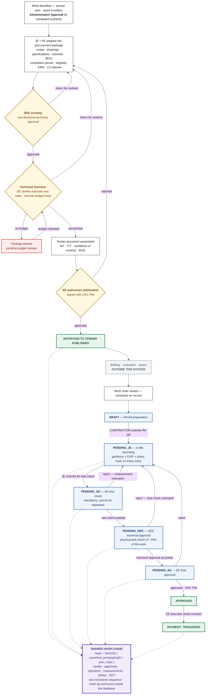
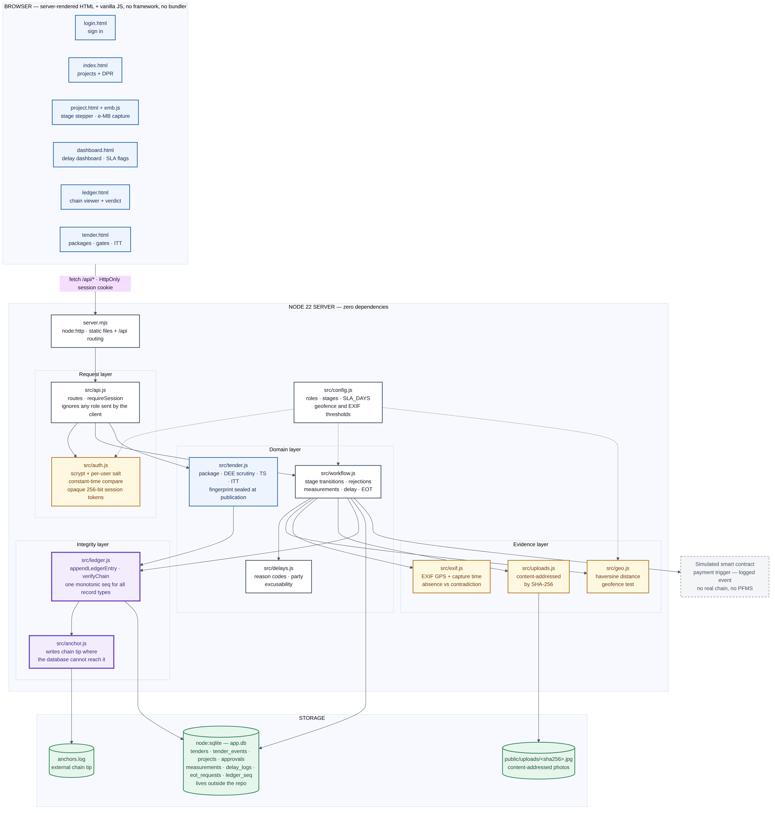

# Construction Workflow Management

**Infrastructure Workflow & Construction Monitoring System** — tender initiation and digital
Measurement Book approval for a Public Works Department, on a tamper-evident hash chain, with a
dashboard that makes the *waiting* visible.

The problem: a work package is tendered on paper, then its bills crawl between four officers.
Files sit for months with nobody accountable, and both the measurements and the tendered
quantities they are checked against can be altered after the fact.



---

## Run it

```bash
git clone https://github.com/yagsu123/Construction_workflow-management.git
cd Construction_workflow-management
npm run seed     # five projects and three tenders, spread across the workflow
npm start        # http://localhost:3000
```

**No `npm install`.** Zero dependencies — just **Node.js 22.5+**, which ships SQLite in its
standard library.

| Command | What it does |
|---|---|
| `npm start` | Run on port 3000 (`PORT=4000` to change) |
| `npm run seed` | Load the demo dataset |
| `npm run verify` | Recompute the whole ledger chain |
| `npm run tamper` | Three attacks — `edit`, `resign`, `photo`, plus `restore` |
| `npm test` | 63 unit tests |
| `npm run stress` | 54 adversarial checks over real HTTP |

**Deploy:** the repo carries a Render blueprint. On [render.com](https://render.com): **New +** →
**Blueprint** → connect the repo → **Apply**. Node is pinned to 22.14.0 there because the start
script passes `--experimental-sqlite`, a Node 22 flag that a newer major rejects outright.

This is a live Node process with a database, so it **will not deploy to Netlify, Vercel static or
GitHub Pages** — those serve files and cannot run the server, leaving every page stuck on
"Loading…".

## Sign in

Five departmental accounts. **Password for all of them: `demo1234`.**

| Username | Role | Designation |
|---|---|---|
| `contractor.ltd` | CONTRACTOR | Primary Contractor |
| `je.patel` | JE | Junior Engineer, Sub-Division II |
| `ae.shah` | AE | Assistant Engineer / SDO |
| `dee.desai` | DEE | Deputy Executive Engineer, Sub-Division II |
| `ee.mehta` | EE | Executive Engineer, Ahmedabad Division |

The browser does not get to choose a role. It comes from a scrypt-hashed sign-in and an
`HttpOnly` session cookie, and a `role` field in a request body is ignored entirely — which is
the whole point of a system claiming accountability.

---

## The two workflows

### 1. Tender initiation — need to published ITT

```
JE / AE prepare the package      scope · drawings · estimate · BOQ
  under an AA reference          completion period · eligibility · EMD · LD clauses
  -> DEE scrutiny                sub-divisional technical approval
     -> EE Technical Sanction    estimate and rates verified · budget head recorded
        -> EE authorises publication (DSC PIN)
           -> ITT PUBLISHED
              -> [bidding and evaluation — outside this system]
                 -> work order recorded -> project opens at DRAFT
```

Three gates, three separate acts, each appended to the ledger — including a *return*, which is
the record a paper file loses. The estimate is written by the JE or AE and sanctioned by the EE
on purpose: an officer who writes an estimate and then sanctions it has sanctioned nothing.
Technical Sanction is refused without a budget head, because sanctioning an estimate with no head
of account against it is how a package reaches tender with no money behind it.

**The package fingerprint is the reason this belongs on the chain.** Every package carries a
SHA-256 over its canonical content — scope, BOQ, estimate, completion period, EMD, eligibility,
LD — excluding status and officer names, which change as the file moves. It is frozen into the
ledger at publication. Inflate a BOQ quantity afterwards and the package no longer matches what
the chain says bidders were shown. That is scope creep made checkable.

A package is editable only in draft; one under scrutiny must be returned first, and a published
one cannot be edited at all.

### 2. Execution — RA bill to payment

```
DRAFT -> PENDING_JE -> PENDING_AE -> PENDING_DEE -> PENDING_EE -> APPROVED -> PAYMENT_TRIGGERED
```

Two independent physical checks stand between the JE's measurements and the EE: the AE
test-checks a prescribed percentage, and the DEE re-checks around 30% himself before according
sub-divisional technical approval. Neither rubber-stamps the other.

**The AE gate cannot be bypassed** — the DEE acting on a file still awaiting test-check is
refused outright, because that transition does not exist in the machine. **A rejection is a
record, not a deletion** — it sends the file back to the JE and is written to the ledger first.

A file sitting in one stage past `SLA_DAYS` (7) is flagged red on the dashboard, attributed to
the role holding it.

### Every e-MB entry must survive three checks

1. **Geofence** — within the site's registered radius (250 m), by haversine distance.
2. **The photo's own account of itself** — EXIF GPS and capture time versus the browser's fix.
   Absence and contradiction are treated differently on purpose: no EXIF at all is accepted but
   permanently stamped `UNVERIFIED`, since screenshots and many devices strip it and absence is
   not evidence of fraud; EXIF that *disagrees* by more than 200 m, or a photo older than 24
   hours, is rejected outright.
3. **The photo is signed** — its SHA-256 goes into the ledger payload, so swapping the file on
   disk is detectable too.

### Delay is recorded separately from approval

*Which desk the file is on* is the corruption signal. *Why the road is not getting built* is a
different question — a package held up by a court stay or the monsoon is not the JE dragging his
feet, and conflating the two is how a system loses the engineers who have to use it.

Ground delays carry a coded reason and a responsible party (external / department / contractor).
The first two are EOT-grantable; the third is not. The dashboard reports both kinds side by side.

---

## The ledger

Tender events, approvals, measurements, delay logs and EOT decisions all append to **one** chain,
ordered by a single monotonic sequence:

```
hash = SHA256( canonical_json(payload) + prev_hash )
```

| Attack | What catches it |
|---|---|
| **edit** — change a row directly in SQLite | `verifyChain()` names the exact index where `prev_hash` stops matching |
| **resign** — change a row *and* recompute every hash after it | the chain is internally consistent, but the tip no longer matches `anchors.log`, which lives outside the database |
| **photo** — swap the image file, leave the database alone | the photo's SHA-256 is inside the signed payload |

`npm run tamper` runs all three, printing the chain before and after each. Sixty seconds, and it
is the whole "why blockchain" argument.



Node 22 · `node:http` · `node:sqlite` · `node:crypto` · server-rendered HTML and vanilla JS. The
database lives outside the repo at `~/.pwd-infra-workflow/app.db` — the working copy sits in a
OneDrive folder, and a sync client holding handles on the `-wal`/`-shm` files produced
`SQLITE_IOERR`, or worse, corruption mid-write. Override with `DB_PATH`.

Tunable by environment: `PORT`, `DB_PATH`, `ANCHOR_PATH`, `DEMO_PASSWORD`, `DSC_PIN`,
`SITE_RADIUS_M`, `EXIF_DRIFT_M`, `EXIF_MAX_AGE_HOURS`, `EXIF_POLICY`.

---

## Not in scope

No real blockchain, no PFMS or Treasury integration, no map tile APIs. No bid submission,
evaluation or comparative statement — tender initiation stops at publication and resumes at the
work order. No financial verification of bills: statutory deductions left the workflow with the
Divisional Accountant role. Sign-in is real but demo-scale — fixed accounts, one shared password,
in-memory sessions. The payment trigger is a logged simulated event.

**Known issue:** the EOT review chain throws. `recommendEot()` and `approveEot()` append a ledger
entry reusing the request's `id`, which is the `eot_requests` primary key, so the insert fails on
the unique constraint. Logging a delay works; moving a request through AE recommendation and EE
approval does not. The fix is the split `src/tender.js` uses — an append-only events table for the
chain, a separate row for current state.

## More

- [`docs/diagrams.md`](./docs/diagrams.md) — seven Mermaid diagrams: tender gates, the stage
  machine, role swimlanes, the e-MB pipeline, delay/EOT, the ledger's attack surface, architecture
- [`DECISIONS.md`](./DECISIONS.md) — why zero dependencies, why the AE gate exists, the non-goals
- [`DEMO.md`](./DEMO.md) — the timed six-move demo script
