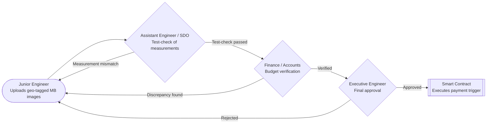
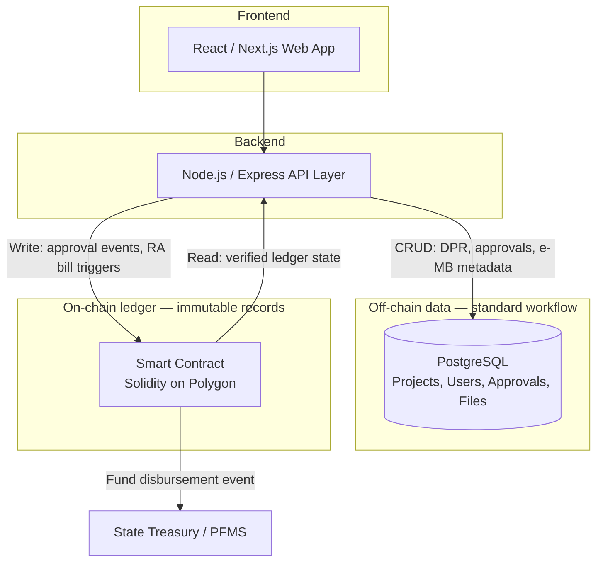
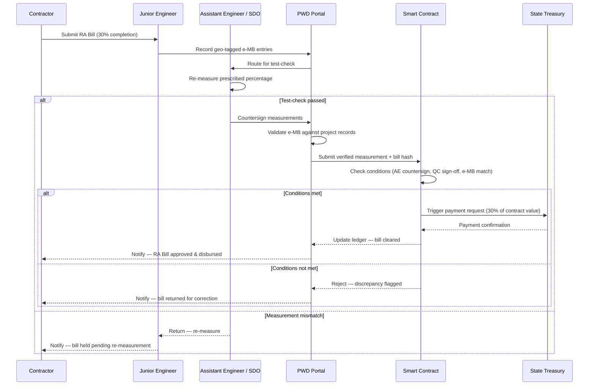

# Infrastructure Workflow & Construction Monitoring System — Build Plan

A phase-by-phase execution plan for a demo-scale build (~4.5 hours), covering the digital MB approval workflow, a simulated blockchain ledger, and an anti-corruption delay dashboard.

**Stack:** React/Next.js frontend · Node.js/Express API · PostgreSQL (or SQLite for speed) for standard data · a hash-chained ledger (simulated smart contract behavior) for immutable records.

> **Revision 2 — Indian PWD context correction.** The original plan routed the JE's measurements
> straight to Finance. That skips the **Assistant Engineer (AE) / Sub-Divisional Officer (SDO)**,
> whose *test-check* of the physical measurements is mandatory in Indian PWD practice — the AE
> re-measures a prescribed percentage of the JE's entries before the file may move for budget
> verification. Roles, the approval sequence and Diagram 1 below have been corrected to
> **JE → AE → Finance → EE**.
>
> **Implementation note:** the delivered build departs from the stack line above — see
> `../DECISIONS.md`. `npm install` would not complete on the build machine, so the project was
> built on Node 22's built-in SQLite with zero dependencies. The data model, the hash chain and
> the screens are unchanged.

---

## Phase 0 — Scope & stack lock-in (20 min)

- [x] Confirm stack: Next.js (or plain React) + Node/Express + SQLite (file-based, zero setup)
- [x] Confirm ledger approach: hand-rolled SHA256 hash chain, not a real Solidity/Polygon deployment
- [x] Confirm the **4** roles to hardcode: Junior Engineer (JE), **Assistant Engineer (AE) / Sub-Divisional Officer**, Finance/Accounts, Executive Engineer (EE)
- [x] Do not attempt: real blockchain SDK, PFMS integration, real GIS APIs, multi-department parallel clearances

**Deliverable:** stack decision made, no revisiting later.

### Role definitions

| Role | Who they are | What they do in this system |
|---|---|---|
| **JE** | Junior Engineer | Creates the DPR; records geo-tagged e-MB entries from the site |
| **AE** | Assistant Engineer / Sub-Divisional Officer | **Test-checks** the JE's measurements — re-verifies a prescribed percentage before the file may move for payment |
| **FIN** | Finance / Accounts | Verifies the claim against the sanctioned budget head |
| **EE** | Executive Engineer | Grants final approval and triggers the smart contract |

The AE gate is the one most often blamed for delay *and* the one most often bypassed in
corruption cases — which makes it exactly the gate worth instrumenting.

---

## Phase 1 — Data model & ledger (45 min)

- [x] `projects` table: id, title, budget, department, current_stage
- [x] `approvals` table: id, project_id, stage, actor_role, status, timestamp, prev_hash, hash
- [x] `measurements` table: id, project_id, photo_url, photo_sha256, lat, lng, timestamp, prev_hash, hash
- [x] `appendLedgerEntry()` function: `hash = SHA256(row_data + prev_hash)` — used by both approvals and measurements so there's one unified audit trail

**Deliverable:** working hash-chain ledger function, unit-testable independent of UI.

---

## Phase 2 — Workflow UI: submit & approve (60 min)

- [x] DPR submission page (title, budget, department)
- [x] Project detail page showing current stage as a horizontal stepper
- [x] Role switcher (dropdown, no real auth) for **JE / AE / Finance / EE** views
- [x] Approve/reject buttons per role, each writing to `approvals` + calling `appendLedgerEntry()`
- [x] **AE test-check step between JE submission and Finance verification**
- [x] Rejection sends the project back to JE (see flowchart below)

**Stage machine:**

```
DRAFT -> PENDING_AE -> PENDING_FINANCE -> PENDING_EE -> APPROVED -> PAYMENT_TRIGGERED
```

Rejection from AE, Finance or EE returns the project to `DRAFT` and is itself written to the
ledger.

**Deliverable:** a project can move JE → AE → Finance → EE → Smart Contract, with visible rejection loops.

---

## Phase 3 — Geo-tagged e-MB upload (45 min)

- [x] Upload form: photo + `navigator.geolocation` (browser API, no key needed) + note
- [x] Hash photo + coordinates + timestamp, chain to ledger via `appendLedgerEntry()`
- [x] Skip real map rendering if time is tight — coordinates as text is enough
- [x] *Added:* the photo's own SHA-256 is part of the ledger payload, so swapping the image file on disk is detectable

**Deliverable:** e-MB entries are geo-tagged and tamper-evident.

---

## Phase 4 — Ledger viewer & delay dashboard (45 min)

- [x] Raw ledger table: every entry with its hash + prev_hash, for the tamper-evidence demo
- [x] Delay dashboard: all projects with "days in current stage" and a red flag past a hardcoded SLA (e.g. 7 days)
- [x] Per-stage delay attribution — which *role* the file is stuck with, so the AE and Finance gates can be compared

**Deliverable:** the two most persuasive demo screens — chain integrity + public delay flagging.

---

## Phase 5 — Seed data (20 min)

- [x] 4–5 realistic fake projects at different stages
- [x] At least one deliberately past-SLA project (for the red-flag demo)
- [x] At least one project stalled **at the AE test-check** — the most realistic bottleneck
- [x] At least one project with a full approval chain ready to click through live

**Deliverable:** demo-ready dataset.

---

## Phase 6 — Rehearse tamper-evidence demo (15–20 min)

- [x] Edit one approval row directly in the DB (change an amount)
- [x] Show the chain-validation check fail because the hash no longer matches `prev_hash`
- [x] Second beat: swap a site photo on disk and show the photo hash check fail while the row itself is untouched
- [x] Practice this as a single 60-second beat — it's the core "why blockchain" argument

**Deliverable:** rehearsed demo narrative.

---

## Diagram 1 — MB Approval Workflow (Flowchart)

JE uploads geo-tagged site images → **AE test-checks the physical measurements** → Finance/Accounts verifies budget → Executive Engineer gives final approval and triggers smart-contract execution. Rejections loop back to JE from the AE, Finance or the EE.



---

## Diagram 2 — Technical Architecture

The React/Next.js frontend talks to a standard API layer, which writes routine project/file/approval data to PostgreSQL, and separately writes approval and measurement events to the smart-contract ledger for immutable record-keeping. The smart contract triggers fund disbursement via the Treasury.



---

## Diagram 3 — RA Bill Data Flow (Sequence Diagram)

A contractor submits a Running Account bill at 30% project completion. The JE records the measurement, the AE test-checks it, the PWD Portal validates the e-MB, the Smart Contract checks conditions, and payment is either triggered via the Treasury or the bill is rejected back to the contractor.


