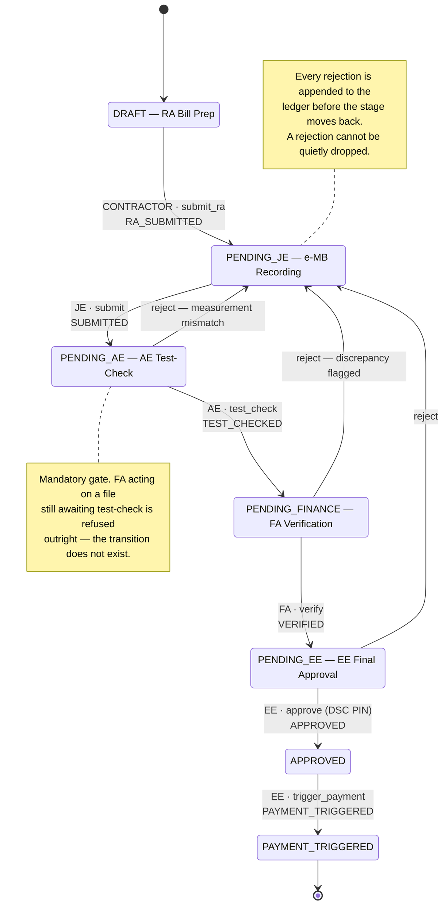
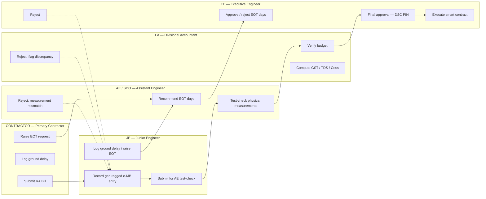
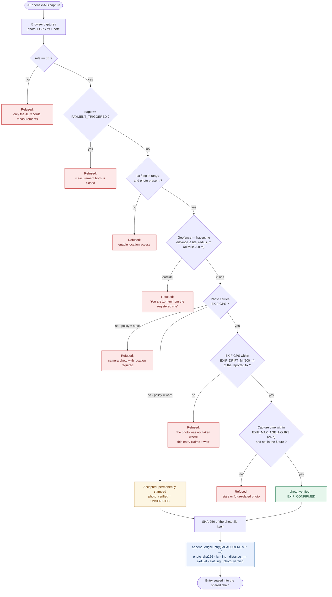
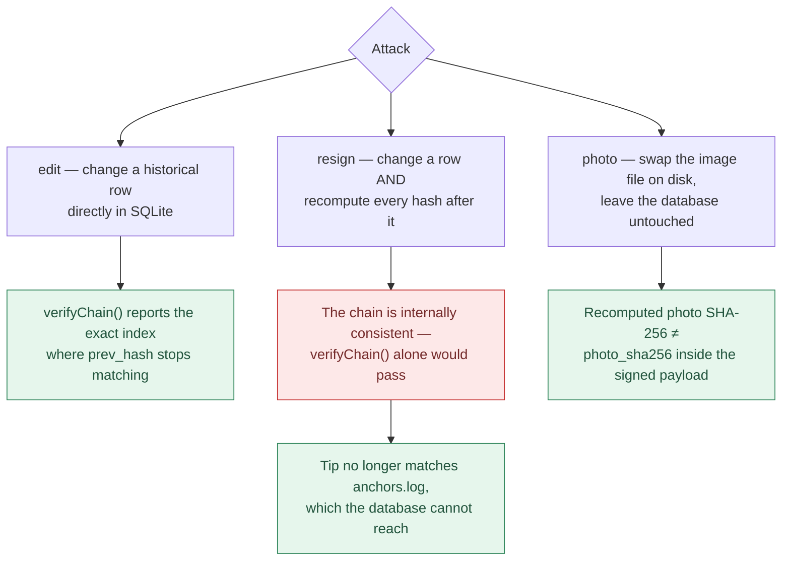
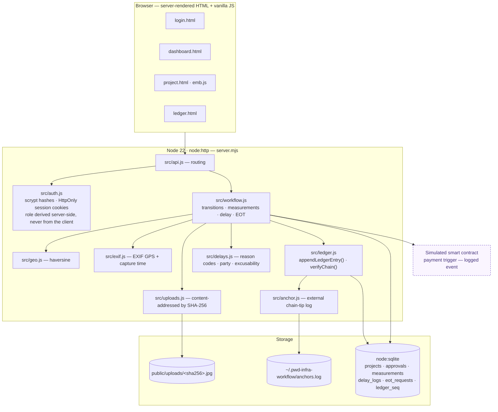

# Infraledger — Workflow Diagrams

Six views of the system, drawn from the code rather than the pitch: the stage machine in
`src/config.js` + `src/workflow.js`, the validation pipeline in `recordMeasurement()`, the
delay/EOT lifecycle in `src/workflow.js` + `src/delays.js`, and the chain in `src/ledger.js`.

All diagrams are Mermaid and render directly on GitHub.

---

## 1. The approval stage machine

The linear path, the three rejection edges, and the one gate that cannot be skipped.



**SLA:** a project sitting in any one stage for more than `SLA_DAYS = 7` is flagged red on the
delay dashboard, attributed to the role holding it.

---

## 2. Who may do what, and when

Each lane can only act while the file is on its own desk.



---

## 3. The e-MB capture pipeline

Three independent checks stand between a photo and a signed measurement. The interesting design
choice is at the EXIF step: **absence is not evidence, but contradiction is.**



Because the photo's own hash is inside the signed payload, swapping the image file on disk
breaks the chain too — not just editing the database row.

---

## 4. Ground delay and Extension of Time

Deliberately separate from the approval workflow. "Which desk is the file sitting on" is the
corruption signal; "why is the road not getting built" is a different question, and conflating
them is how a system loses the engineers who have to use it.


Every step marked in blue is itself a ledger entry — the delay log, the AE recommendation and the
EE decision are all appended to the same chain as the approvals.

---

## 5. The ledger: one chain, four record types

Approvals, measurements, delay logs and EOT decisions share a single monotonic `seq` counter, so
they form **one** ordered chain rather than four parallel ones.

```mermaid
flowchart LR
    G["GENESIS<br/>prev_hash = 000…0"]:::gen
    B1["seq 1 · APPROVAL<br/>RA_SUBMITTED"]
    B2["seq 2 · MEASUREMENT<br/>photo_sha256 · lat/lng"]
    B3["seq 3 · APPROVAL<br/>SUBMITTED"]
    B4["seq 4 · DELAY_LOG<br/>LAND_ACQUISITION"]
    B5["seq 5 · APPROVAL<br/>REJECTED — mismatch"]
    B6["seq 6 · EOT_APPROVAL<br/>PENDING_EE"]
    B7["seq n · APPROVAL<br/>PAYMENT_TRIGGERED"]

    G --> B1 --> B2 --> B3 --> B4 --> B5 --> B6 --> B7

    B7 --> ANC["anchors.log<br/>chain tip written OUTSIDE the database"]:::anc

    classDef gen fill:#edf2f7,stroke:#4a5568;
    classDef anc fill:#faf5ff,stroke:#6b46c1,color:#44337a;
```



```
hash = SHA256( canonical_json(payload) + prev_hash )
```

### Why the anchor exists



`npm run tamper` runs all three, printing the chain state before and after each.

---

## 6. System architecture

Zero dependencies — Node 22's standard library only. No framework, no bundler, no `node_modules`.



The database lives outside the repo (`~/.pwd-infra-workflow/app.db`) because the working copy sits
in a OneDrive-synced folder, and a sync client holding handles on the `-wal`/`-shm` side files
produces `SQLITE_IOERR` — or worse, corruption mid-write.
