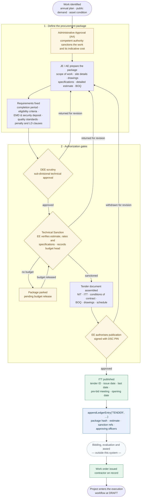
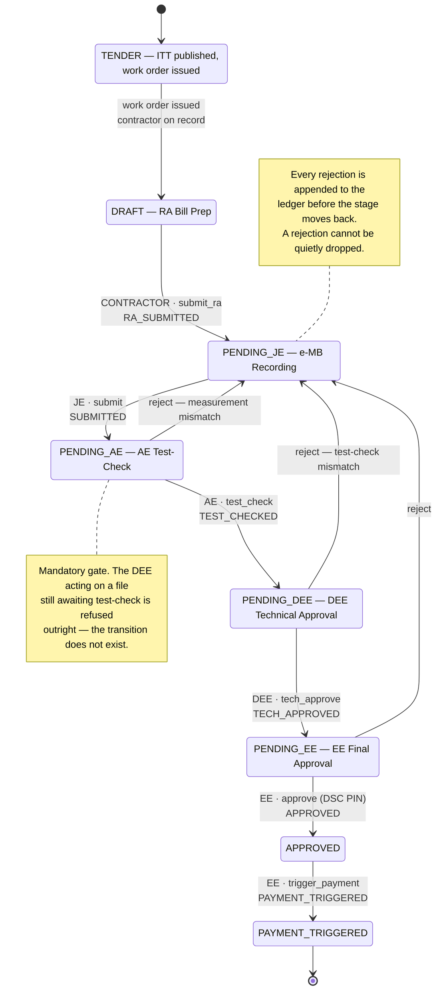
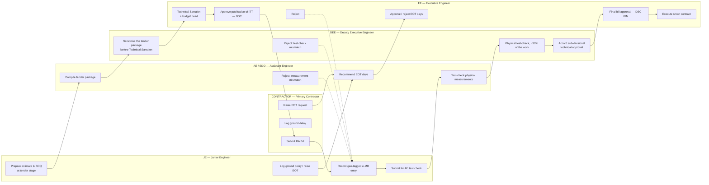
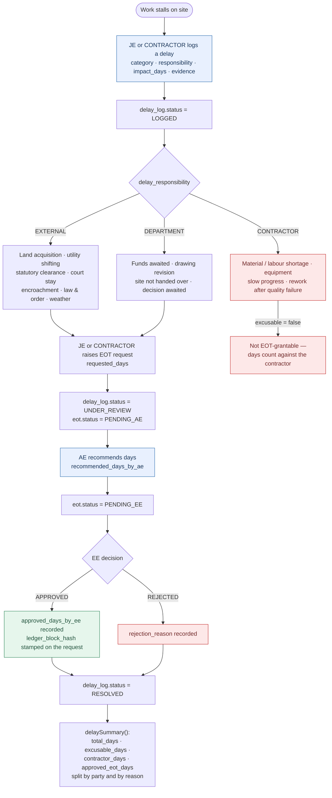
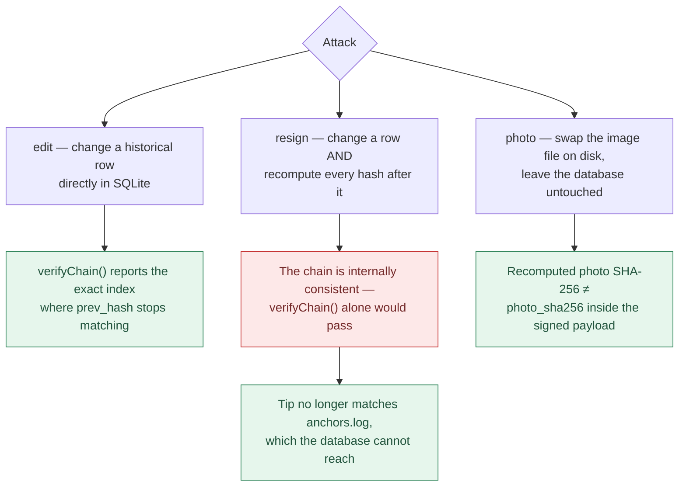
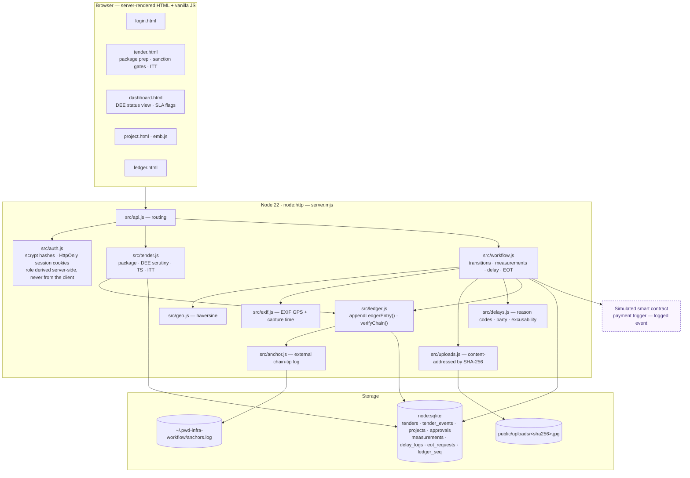

# Infraledger — Workflow Diagrams

Seven views of the system: the tender initiation gates that bring a work package into existence,
the execution stage machine (`src/config.js` + `src/workflow.js`), the validation pipeline in
`recordMeasurement()`, the delay/EOT lifecycle (`src/workflow.js` + `src/delays.js`), and the
chain in `src/ledger.js`.

All diagrams are Mermaid and render directly on GitHub.

> **Role:** the Divisional Accountant / FA has been replaced throughout by the
> **DEE — Deputy Executive Engineer**, who conducts the physical test-check of around 30% of the
> work and accords sub-divisional technical approval before the file reaches the EE. Budget
> verification and statutory deductions left the workflow with the Divisional Accountant.

---

## 1. Tender initiation — from need to published ITT

Everything upstream of a contractor existing. The package is defined, sanctioned and authorized
before an Invitation to Tender goes out. **Bidding itself is out of scope** — the flow stops at
publication and resumes at award.



Four authorization steps, deliberately not all held by the same officer: **AA** establishes that
the work should happen, **DEE scrutiny** gives sub-divisional technical approval, **Technical
Sanction** confirms the estimate is sound and records the budget head against it, and only then
can the EE authorize publication — the same DSC-signed action pattern used for final bill approval
downstream. The estimate is written by the JE or AE and sanctioned by the EE on purpose: an
officer who writes an estimate and then sanctions it has sanctioned nothing.

Implemented in `src/tender.js`, with the state machine in `TENDER_TRANSITIONS`
(`src/config.js`) and 18 tests in `tests/tender.test.js`.

---

## 2. The execution stage machine

The linear path, the three rejection edges, and the one gate that cannot be skipped.



**SLA:** a project sitting in any one stage for more than `SLA_DAYS = 7` is flagged red on the
delay dashboard, attributed to the role holding it.

---

## 3. Who may do what, and when

Each lane can only act while the file is on its own desk.



---

## 4. The e-MB capture pipeline

Three independent checks stand between a photo and a signed measurement. The interesting design
choice is at the EXIF step: **absence is not evidence, but contradiction is.**


Because the photo's own hash is inside the signed payload, swapping the image file on disk
breaks the chain too — not just editing the database row.

---

## 5. Ground delay and Extension of Time

Deliberately separate from the approval workflow. "Which desk is the file sitting on" is the
corruption signal; "why is the road not getting built" is a different question, and conflating
them is how a system loses the engineers who have to use it.



Every step marked in blue is itself a ledger entry — the delay log, the AE recommendation and the
EE decision are all appended to the same chain as the approvals.

---

## 6. The ledger: one chain, five record types

Tender events, approvals, measurements, delay logs and EOT decisions share a single monotonic
`seq` counter, so they form **one** ordered chain rather than five parallel ones.

```mermaid
flowchart LR
    G["GENESIS<br/>prev_hash = 000…0"]:::gen
    B0["seq 1 · TENDER<br/>ITT published"]
    B1["seq 2 · APPROVAL<br/>RA_SUBMITTED"]
    B2["seq 3 · MEASUREMENT<br/>photo_sha256 · lat/lng"]
    B3["seq 4 · APPROVAL<br/>SUBMITTED"]
    B4["seq 5 · DELAY_LOG<br/>LAND_ACQUISITION"]
    B5["seq 6 · APPROVAL<br/>REJECTED — mismatch"]
    B6["seq 7 · EOT_APPROVAL<br/>PENDING_EE"]
    B7["seq n · APPROVAL<br/>PAYMENT_TRIGGERED"]

    G --> B0 --> B1 --> B2 --> B3 --> B4 --> B5 --> B6 --> B7

    B7 --> ANC["anchors.log<br/>chain tip written OUTSIDE the database"]:::anc

    classDef gen fill:#edf2f7,stroke:#4a5568;
    classDef anc fill:#faf5ff,stroke:#6b46c1,color:#44337a;
```



```
hash = SHA256( canonical_json(payload) + prev_hash )
```

Putting the tender package on the same chain is what makes scope creep visible: the published
estimate and BOQ are sealed before a single bill exists, so a later measurement that exceeds the
tendered quantity is checkable against a record nobody can quietly revise.

### Why the anchor exists



`npm run tamper` runs all three, printing the chain state before and after each.

---

## 7. System architecture

Zero dependencies — Node 22's standard library only. No framework, no bundler, no `node_modules`.



`src/tender.js`, `public/tender.html`, and the `tenders` / `tender_events` tables implement
diagram 1. `tenders` holds current state; `tender_events` is append-only and carries the chain —
a split the delay and EOT tables do not make, which is why their review steps collide on the
primary key.

The database lives outside the repo (`~/.pwd-infra-workflow/app.db`) because the working copy sits
in a OneDrive-synced folder, and a sync client holding handles on the `-wal`/`-shm` side files
produces `SQLITE_IOERR` — or worse, corruption mid-write.
